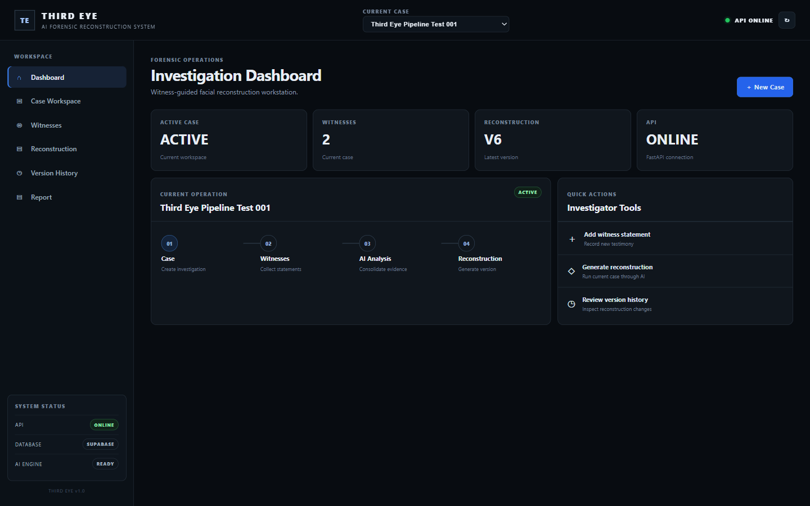
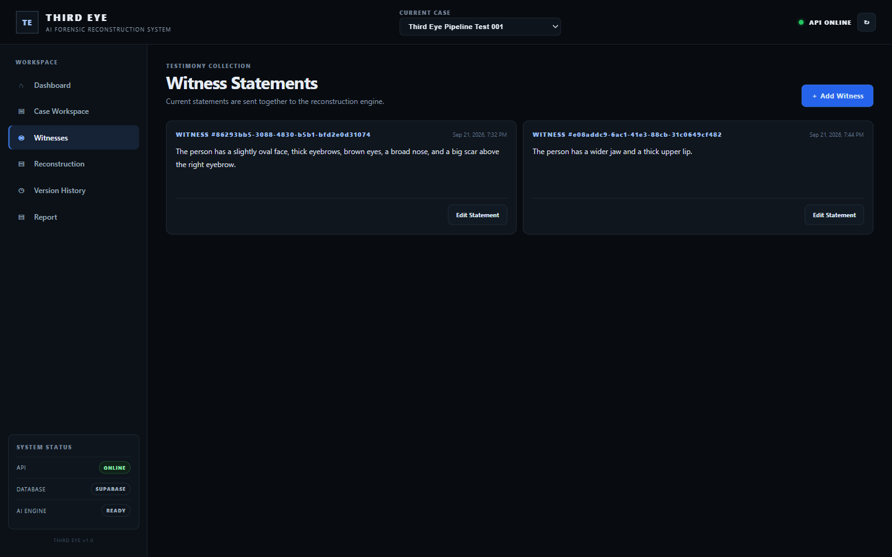
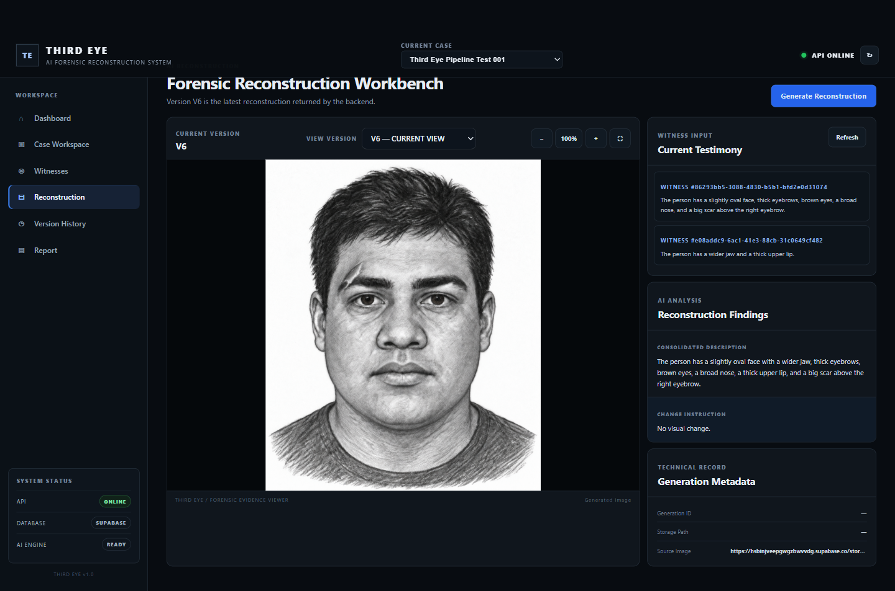
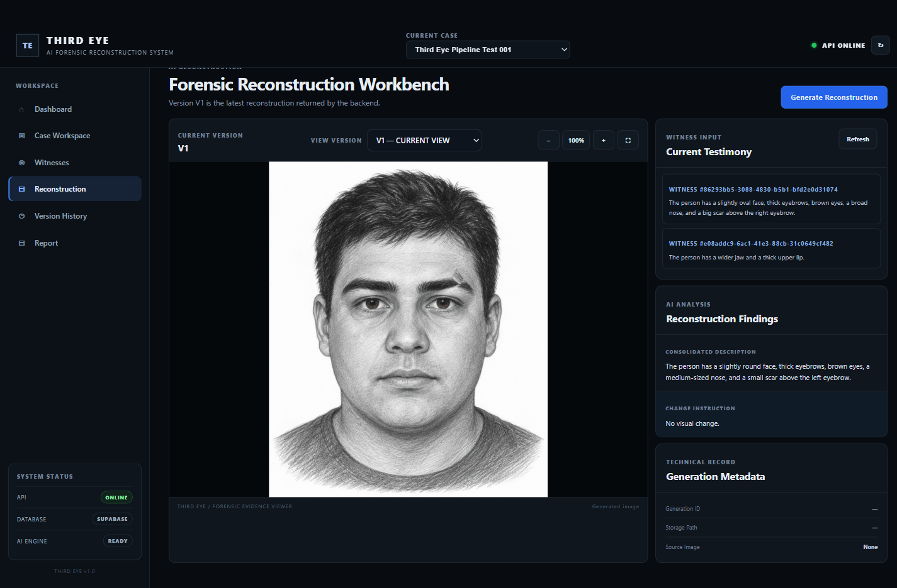
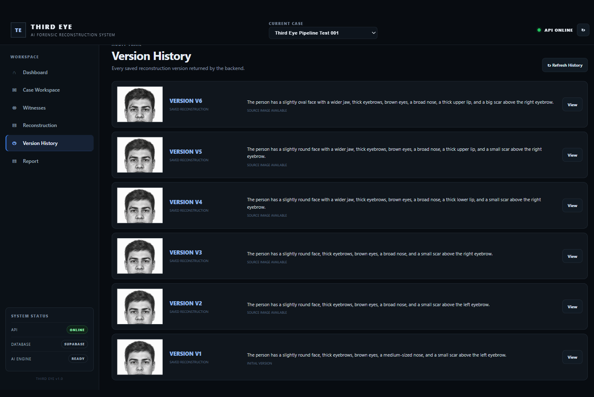

<div align="center">

# 👁️ THIRD EYE

### AI-Powered Forensic Face Reconstruction System

*Turn witness testimony into evolving forensic sketches — version by version.*


</div>

---

## 📖 Overview

**Third Eye** is a witness-guided forensic face reconstruction workstation. Investigators record statements from one or more witnesses, and the system uses a Large Language Model to merge them into a single, consistent facial description. An image model then renders that description as a **traditional graphite-pencil forensic composite sketch**.

When a witness remembers something new or corrects an earlier detail, Third Eye does not start over. It works out *only what changed*, edits the previous sketch accordingly, and saves the result as a new version. The same person stays recognisable across every revision, and the full history is preserved.

## ✨ Key Features

| Feature | Description |
|---|---|
| 🗂️ **Case Management** | Create and switch between investigation cases |
| 🗣️ **Multi-Witness Statements** | Add and edit testimony from multiple witnesses per case |
| 🧠 **LLM Consolidation** | Combines all statements into one natural-language description, with no fixed schema |
| 🎨 **Forensic Sketch Generation** | Realistic black-and-white pencil composite, front-facing, neutral expression |
| ✏️ **Incremental Editing** | Applies only the corrections to the previous sketch, so identity stays consistent |
| 🕓 **Version History** | Every reconstruction (V1, V2, V3…) is stored and can be revisited |
| 📊 **Investigation Dashboard** | Live case stats and a guided workflow |
| 🖨️ **Printable Report** | Case summary with witness statements and reconstruction output |

## 🖼️ Screenshots

### Investigation Dashboard


### Witness Statement Collection


### Consolidated Facial Description


### Initial AI Reconstruction (V1)


### Reconstruction Version History


## 🔄 How It Works

```
 Witness Statements
        │
        ▼
 ┌───────────────────┐
 │  LLM Consolidation │  → One unified facial description
 └───────────────────┘  → Change instruction (only what changed)
        │
        ▼
 ┌───────────────────┐
 │  Image Model       │  V1: generate new sketch
 │  (gpt-image-2)     │  V2+: edit the previous sketch
 └───────────────────┘
        │
        ▼
 Supabase Storage  +  Database  →  Versioned reconstruction history
```

1. **Create a case** and add witness statements.
2. **Run reconstruction.** The LLM returns a *Consolidated Description* and a *Change Instruction*.
3. **V1** is generated from scratch. **V2, V3…** are produced by editing the previous image using only the change instruction.
4. Each version is uploaded to Supabase Storage and recorded in the database.

## 🧱 Tech Stack

- **Backend:** Python, FastAPI, Uvicorn, Pydantic
- **AI:** OpenAI-compatible API (LLM for consolidation, `gpt-image-2` for image generation/editing)
- **Database & Storage:** Supabase (PostgreSQL + Storage bucket)
- **Frontend:** HTML, CSS, Vanilla JavaScript

## 📁 Project Structure

```
ThirdEye/
├── backend/
│   ├── main.py                  # FastAPI app & API routes
│   ├── llm_service.py           # Witness consolidation (LLM)
│   ├── image_service.py         # Sketch generation & editing
│   ├── reconstruction_state.py  # Case state helpers
│   ├── database.py              # Supabase client
│   ├── config.py                # Environment configuration
│   └── requirements.txt
├── third-eye-frontend/
│   ├── index.html
│   ├── css/style.css
│   └── js/app.js
└── screenshots/
```

## ⚙️ Getting Started

### Prerequisites

- Python **3.10+**
- A **Supabase** project (free tier works)
- Access to an **OpenAI-compatible** API endpoint with an LLM and an image model
- A simple static server for the frontend (VS Code *Live Server* works well)

### Step 1 — Clone the repository

```bash
git clone https://github.com/ematty246/ThirdEye.git
cd ThirdEye
```

### Step 2 — Set up Supabase

1. Create a new project at [supabase.com](https://supabase.com).
2. Create these tables:

   | Table | Columns used by the app |
   |---|---|
   | `cases` | `id`, `case_name`, `created_at` |
   | `witnesses` | `id`, `case_id`, `statement`, `created_at` |
   | `reconstruction_versions` | `id`, `case_id`, `version_number`, `consolidated_description`, `image_url`, `source_image_url` |

3. Create a **public** Storage bucket named **`forensic-sketches`**.
4. Copy your **Project URL** and **API key** from *Project Settings → API*.

### Step 3 — Configure the backend

```bash
cd backend
python -m venv venv

# Windows
venv\Scripts\activate
# macOS / Linux
source venv/bin/activate

pip install -r requirements.txt
```

Create a `.env` file inside `backend/`:

```env
OPENAI_BASE_URL=http://127.0.0.1:10531/v1
OPENAI_API_KEY=your_api_key
LLM_MODEL=your_llm_model_name

SUPABASE_URL=https://your-project.supabase.co
SUPABASE_KEY=your_supabase_key
```

> 💡 `OPENAI_BASE_URL` can point to OpenAI or any OpenAI-compatible gateway. The image model is set in `image_service.py` (`IMAGE_MODEL`).

### Step 4 — Start the backend

```bash
uvicorn main:app --reload --port 8000
```

- API: <http://127.0.0.1:8000>
- Interactive docs: <http://127.0.0.1:8000/docs>

### Step 5 — Start the frontend

Open `third-eye-frontend/index.html` with **Live Server** (port `5500`), or run:

```bash
cd third-eye-frontend
python -m http.server 5500
```

Then visit <http://127.0.0.1:5500>.

> ⚠️ CORS only allows `localhost:5500` / `127.0.0.1:5500` by default. If you use another port, add it to `allow_origins` in `backend/main.py`.

### Step 6 — Run your first reconstruction

1. Create a new case from the top bar.
2. Open **Witnesses** and add one or more statements.
3. Open the **Reconstruction** view and generate **V1**.
4. Edit a statement or add a correction, then generate again to get **V2**, **V3** and so on.
5. Use the version selector to compare versions, and open **Report** to print the case summary.

## 🔌 API Reference

| Method | Endpoint | Description |
|---|---|---|
| `GET` | `/` | Health check |
| `POST` | `/cases` | Create a case |
| `GET` | `/cases` | List all cases |
| `POST` | `/cases/{case_id}/witnesses` | Add a witness statement |
| `GET` | `/cases/{case_id}/witnesses` | List witnesses for a case |
| `PUT` | `/witnesses/{witness_id}` | Update a witness statement |
| `POST` | `/cases/{case_id}/reconstruction` | Generate the next reconstruction version |
| `GET` | `/cases/{case_id}/reconstruction` | Get the latest reconstruction |
| `GET` | `/cases/{case_id}/reconstruction/history` | Get all reconstruction versions |

## 🛠️ Troubleshooting

| Problem | Fix |
|---|---|
| `SUPABASE_URL and SUPABASE_KEY must be set` | Check that `.env` exists inside `backend/` |
| CORS error in browser | Serve the frontend on port `5500`, or update `allow_origins` |
| Frontend can't reach API | Make sure the backend runs on `8000`, or set `localStorage.thirdEyeApiBase` |
| Image upload fails | Confirm the `forensic-sketches` bucket exists and is public |

## ⚖️ Disclaimer

Third Eye is an **assistive research and demonstration tool**. AI-generated sketches are approximations based on witness descriptions and must **not** be used as sole evidence to identify or accuse any individual.

## 👤 Author

**ematty246** — [GitHub](https://github.com/ematty246)

---

<div align="center">

⭐ If you find this project useful, consider giving it a star!

</div>
